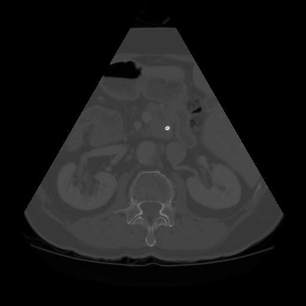
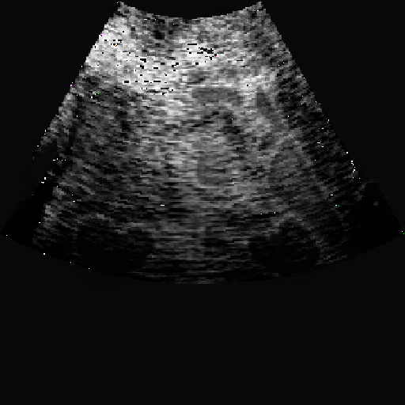

# Semantically Ct-Ultrasound image-to-image translation
 

This is the project for unpaired i2i translation between CT and ultrasound images, following the structure of [pytorch-CycleGAN-and-pix2pix](https://github.com/junyanz/pytorch-CycleGAN-and-pix2pix), with multiple modifications inserted. The structure of codes are maintained as similar to the original CycleGAN repository as possible so that further extensions can be easierly implemented.


## Dataset
### Abdominal CT dataset
[AbdomenCT-1K](https://github.com/JunMa11/AbdomenCT-1K). We used the fully annotated part of this benchmark (https://abdomenct-1k-fully-supervised-learning.grand-challenge.org/). Please refer to the instructions in CT_preprocessing folder to check how to deal with the raw CT data.

### Abdominal Ultrasound dataset
(https://www.kaggle.com/datasets/ignaciorlando/ussimandsegm)

###
This code takes colormap image as semantic mask label, please change 'n_classes' in base options to match your class number.
Please store the images and masks in folders named as 'trainA', 'trainmaskA', 'trainB', 'trainmaskB', 'testA', 'test_maskA', 'testB' and 'testmaskB'

## Train
```bash
python train.py --dataroot ./datasets/ctus --name ctus_cyclegan --model cycle_gan
```
## Test
```bash
python test.py --dataroot ./datasets/ctus --name ctus_cyclegan --model cycle_gan
```

##
If you find this repository useful for your research, please cite our paper:

```bibtex
@INPROCEEDINGS{10860598,
  author={Song, Yuhan and Chong, Nak Young},
  booktitle={2024 IEEE International Conference on Cyborg and Bionic Systems (CBS)}, 
  title={S-CycleGAN: Semantic Segmentation Enhanced CT-Ultrasound Image-to-Image Translation for Robotic Ultrasonography}, 
  year={2024},
  pages={115-120},
  doi={10.1109/CBS61689.2024.10860598}
}
